# MATLAB in Engineering and Simulation: A Case Study in Wireless Network Design

MATLAB is a numerical computing platform widely used in engineering to model and test systems before building them — cutting cost and risk compared to trial-and-error in the real world. This repository documents a hands-on case study in wireless network simulation: placing base stations on the GUC campus and testing coverage and user mobility with ray tracing, comparing this manual approach against a Python-based reinforcement learning method, and a supplementary indoor propagation study.

## Contents
- [Static Base Station Coverage](#static-base-station-coverage)
- [Mobility Simulation: Linear Motion](#mobility-simulation-linear-motion)
- [Channel and Rate Model](#channel-and-rate-model)
- [Antenna Height Comparison](#antenna-height-comparison)
- [Learning-Based Base Station Placement (DQN)](#learning-based-base-station-placement-dqn)
- [Supplementary: Indoor Reflection & Diffraction Study](#supplementary-indoor-reflection--diffraction-study)
- [Files](#files)

---

## Static Base Station Coverage

To demonstrate MATLAB's simulation capabilities in a practical engineering context, a small-scale wireless coverage simulation was built using the Antenna Toolbox's ray-tracing engine. The German University in Cairo (GUC) campus was imported directly from OpenStreetMap and rendered as a 3D scene in MATLAB's Site Viewer, giving accurate building geometry without manual modeling.

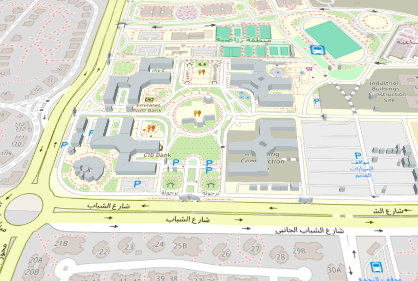

Four base stations were placed at four campus buildings, each set to 2.5 GHz with a 12 m antenna height. Twenty users (five per building) were placed around their nearest base station. Rays were traced from each base station to its own users using an SBR propagation model with up to three reflections, and a combined coverage map was generated.

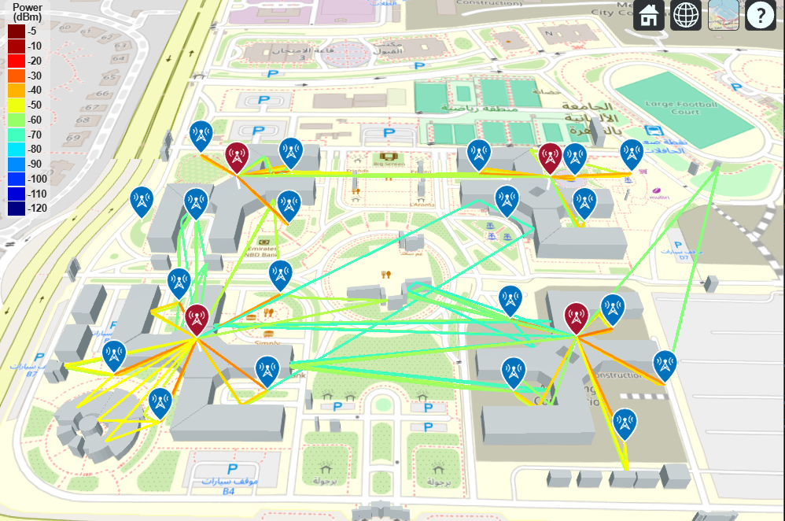

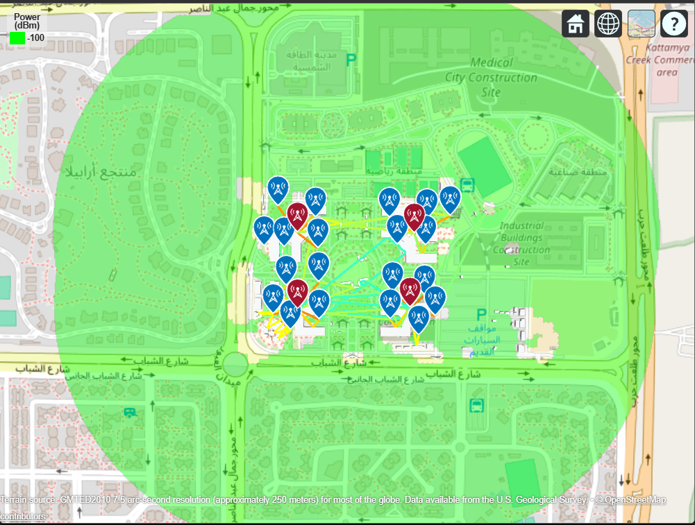

Some users showed little or no signal due to buildings blocking the path — a limitation of fixed-height antenna placement.

**Script:** [`static_coverage_4BS.m`](./static_coverage_4BS.m)

---

## Mobility Simulation: Linear Motion

Building on the static case, a second experiment modeled user mobility by moving three receivers in straight lines away from Building C's base station at a constant 1.4 m/s (average pedestrian walking speed) over a 25-second window, while continuously re-computing the ray-traced channel at each time step.

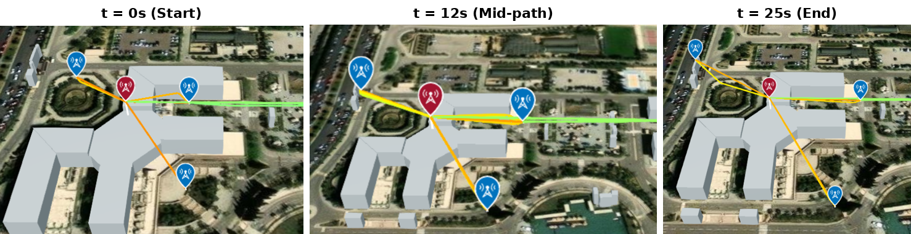

Individual user rates fluctuated between roughly 2 and 6.5 bps/Hz throughout the walk, with the sum rate ranging from about 8 to 17 bps/Hz — rather than declining steadily as users moved farther from the base station, both metrics rose and fell repeatedly. This is a direct consequence of multipath: each user's signal is made up of several rays (direct, reflected, and diffracted paths) that combine constructively or destructively depending on their relative phase as the user's exact position shifts. In this campus environment, a user's position relative to surrounding buildings mattered more than raw distance from the base station.

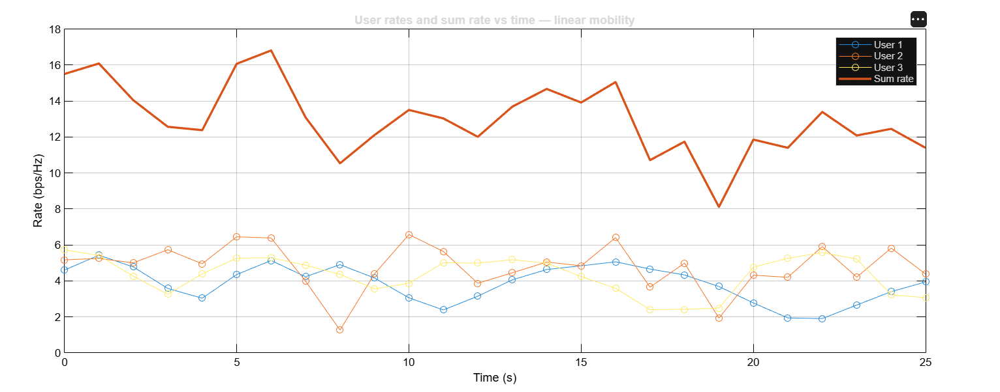

One practical issue came up while building this simulation: initial user rates came out unrealistically low (on the order of 0.01 bps/Hz), which traced back to the SNR formula lacking a transmit power term — only channel gain divided by noise was being computed. Adding an assumed transmit power of 70 dBm brought the results into a realistic range.

**Script:** [`mobility_linear_12m.m`](./mobility_linear_12m.m)

---

## Channel and Rate Model

To evaluate signal quality at each user position, the ray-traced output from MATLAB was converted into a channel gain, SNR, and data rate using standard wireless communication formulas.

Each ray returned by `raytrace` has a path loss (dB) and phase shift. These were combined into a single complex channel gain:

```
h = Σᵢ 10^(−Lᵢ/20) · e^(jφᵢ)
```

where Lᵢ is the path loss and φᵢ the phase shift of ray i. Summing the rays as complex values (rather than simply averaging path loss) captures multipath: rays can add constructively or cancel depending on their relative phase.

SNR at each user:
```
γ = (Ptx · |h|²) / N₀
```

Achievable rate per user (Shannon capacity):
```
R = log₂(1 + γ)   [bits/s/Hz]
```

Sum rate across all users:
```
R_sum = Σₖ Rₖ
```

---

## Antenna Height Comparison

The linear mobility experiment was repeated at antenna heights of 12 m, 20 m, and 30 m to examine the effect of base station height on user rates. All three heights produced the same overall pattern — sharp, irregular fluctuations driven by multipath rather than a smooth trend — and comparable overall magnitude (individual users generally 2–7 bps/Hz, sum rate 8–18 bps/Hz).

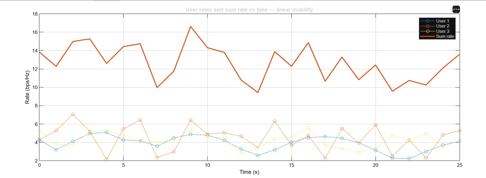

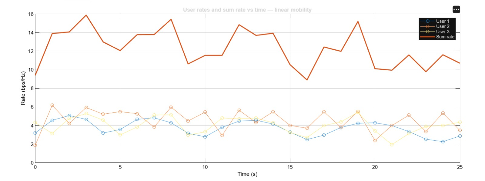

The main difference was in peak performance: **20 m** reached the highest sum rate (~18 bps/Hz) and highest individual peak, while **30 m** produced the lowest peak sum rate (~15.9 bps/Hz) of the three. This suggests increasing antenna height does not straightforwardly improve performance in this scenario — 20 m outperformed both 12 m and 30 m, indicating a possible optimal height for this building and user layout rather than a simple "higher is better" relationship.

**Scripts:** [`mobility_linear_12m.m`](./mobility_linear_12m.m) *(re-run with `AntennaHeight = 20` / `30`)*

---

## Learning-Based Base Station Placement (DQN)

As an alternative to manually surveyed base station positions, a Deep Q-Network (DQN) agent was trained to learn an optimal placement instead. The agent selected from a grid of candidate points across D Building's footprint, with reward defined as the minimum per-user rate across all simulated users — a fairness objective favoring positions that serve the worst-off user well, rather than maximizing average performance at some users' expense.

The agent was trained across five independent runs with varying user populations (200 and 2000 users) to test whether results held regardless of population size.

| Run | K | Final policy | Best possible | Used reward | Gap | Jain's index | Coverage | BS position (x,y) |
|---|---|---|---|---|---|---|---|---|
| 1 | 200 | 6.990 | 7.001 | 7.001 | 0.000 | 0.9484 | 100% | (37.26, 2.28) |
| 2 | 200 | 6.204 | 7.167 | 7.167 | 0.000 | 0.9650 | 100% | (37.26, -6.72) |
| 3 | 200 | 5.234 | 7.101 | 7.101 | 0.000 | 0.9529 | 100% | (37.26, -6.72) |
| 4 | 2000 | 6.347 | 6.900 | 6.900 | 0.000 | 0.9471 | 100% | (37.26, -0.72) |
| 5 | 2000 | 6.876 | 6.876 | 6.876 | 0.000 (exact) | 0.9461 | 100% | (37.26, 2.28) |

Since DQN's final policy doesn't always match the best action it encountered during training, each run also recorded the best possible reward (found by checking every candidate point) and the Gap between it and the reported result. This Gap was zero in every run, meaning the true optimum was always recovered.

Jain's fairness index stayed between 0.946 and 0.965, and coverage reached 100% in all five runs. The chosen base station position also converged on nearly the same location (x ≈ 37.26 m) regardless of user count, suggesting this is a genuinely strong location rather than a result specific to one run's random users.

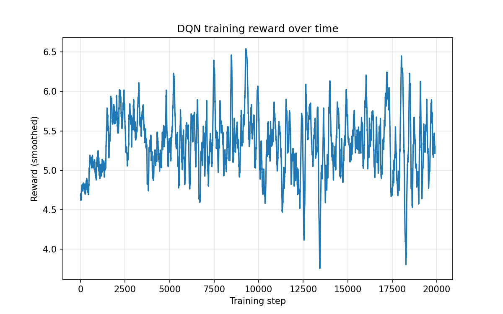

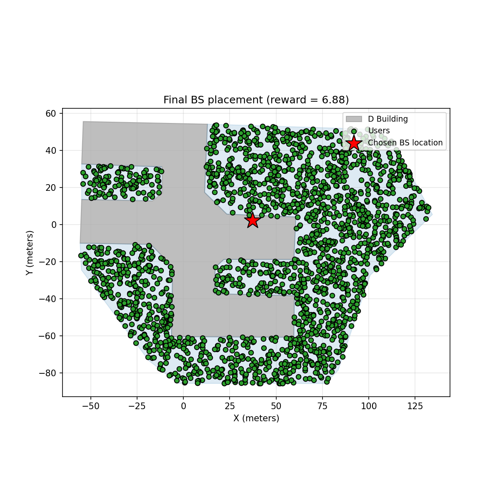

This reinforces a theme from the ray-tracing analysis: coverage alone does not guarantee balanced service quality, and fairness-aware optimization — whether through reinforcement learning or careful manual placement — is needed to avoid leaving some users underserved. The same approach is not building-specific: the same candidate-grid and reward formulation could be applied to any building on campus, making it a general method rather than a one-off solution for a single site.

**Files:** [`bs_placement_env.py`](./bs_placement_env.py) · [`campus_polygons_local_meters.json`](./campus_polygons_local_meters.json)

---

## Supplementary: Indoor Reflection & Diffraction Study

A smaller supplementary study investigated how the number of reflections and diffractions affects predicted received power in an indoor MATLAB ray-tracing scene, comparing a line-of-sight receiver against an obstructed one.

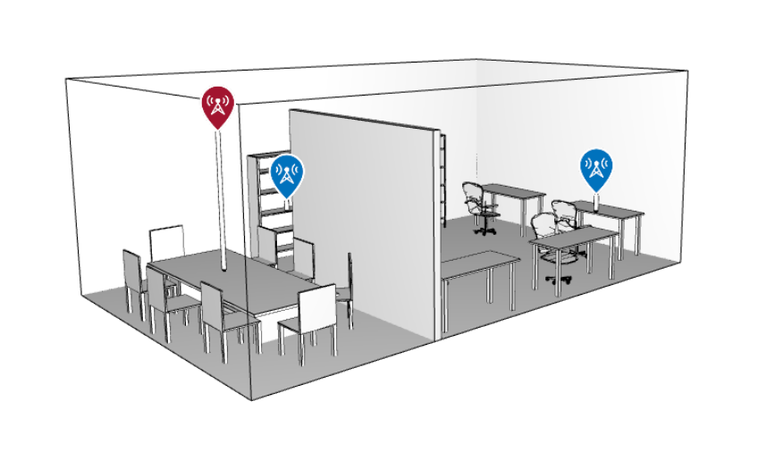

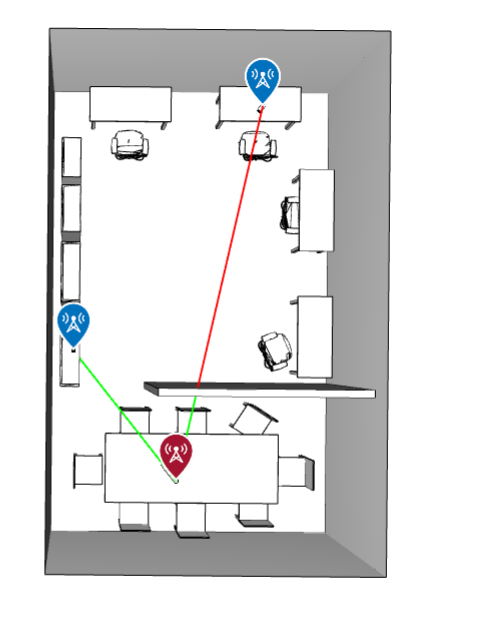

At 0 reflections, the desk receiver showed **-Inf dBm** — no valid propagation path existed because the direct line was blocked. Enabling just 1 reflection restored connectivity to **-22.79 dBm**; increasing reflections further to 2 and 3 only improved this marginally (-21.67, -21.11 dBm), showing diminishing returns beyond the first reflection. The shelf receiver (clear line of sight) stayed stable around -7.5 to -8 dBm regardless of reflection count.

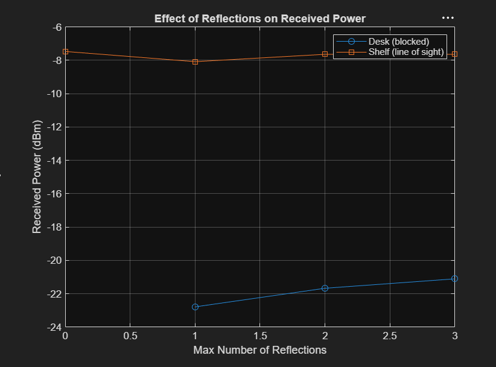

Testing reflection-only, diffraction-only, and combined propagation in isolation for the obstructed desk receiver:

| Mode | Received Power |
|---|---|
| Reflection only | -22.79 dBm |
| Diffraction only | -16.53 dBm |
| Combined | -11.95 dBm |

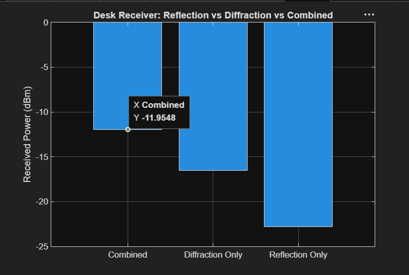

Diffraction alone outperformed reflection alone by over 6 dB, and combining both improved received power further — showing the two mechanisms contribute additively rather than one substituting for the other. This demonstrates that relying on reflection-only ray tracing settings (sometimes done to reduce computation time) can significantly underestimate coverage near sharp obstructions like partition walls.

**Script:** [`indoor_reflection_diffraction.m`](./indoor_reflection_diffraction.m)

---

## Files

| File | Description |
|---|---|
| `static_coverage_4BS.m` | 4 base stations, 20 users, static coverage + ray tracing |
| `mobility_linear_12m.m` | Linear user mobility, rate/SNR computation (re-run at 12/20/30m) |
| `indoor_reflection_diffraction.m` | Indoor reflection vs. diffraction propagation study |
| `bs_placement_env.py` | DQN environment for D Building BS placement |
| `campus_polygons_local_meters.json` | Building/valid-region polygons in local meters |
